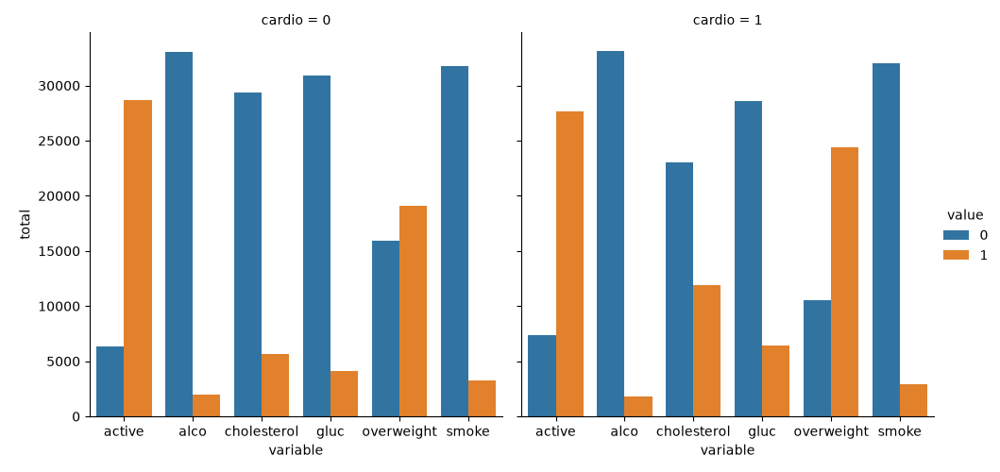
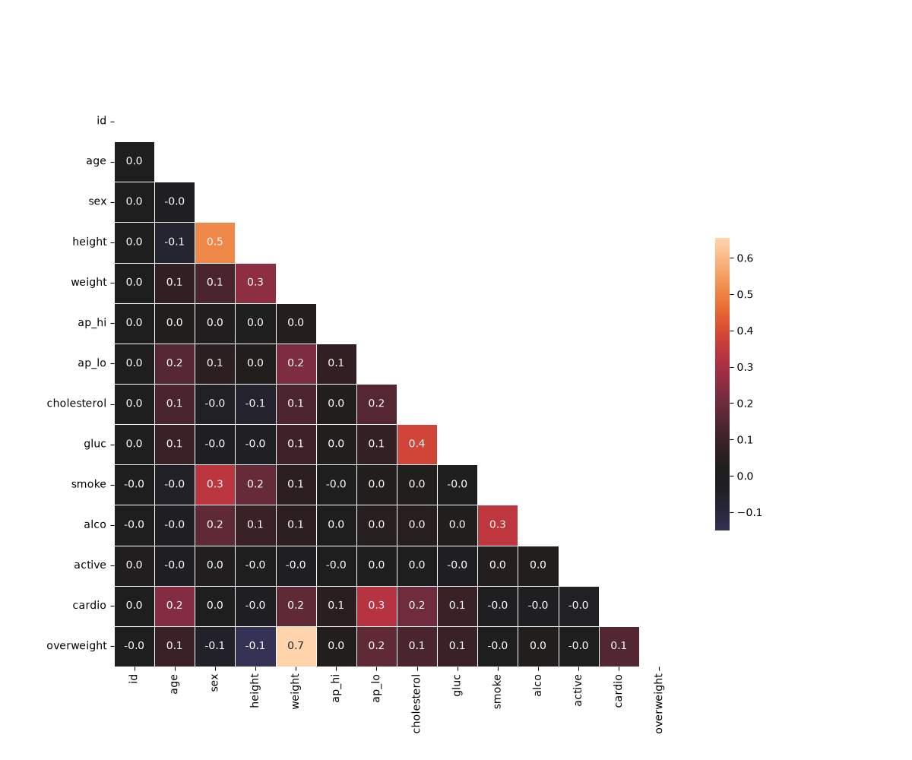

# Medical Data Visualizer

## Overview

This project analyzes medical examination data and visualizes relationships between various health indicators and cardiovascular disease.

The project was completed as part of the freeCodeCamp Data Analysis with Python curriculum and demonstrates data cleaning, feature engineering, data transformation, and data visualization using Python.

## Technologies Used

- Python
- Pandas
- NumPy
- Matplotlib
- Seaborn

## Dataset

The dataset contains medical examination records including:

- Age
- Height
- Weight
- Blood Pressure
- Cholesterol
- Glucose Levels
- Smoking Status
- Alcohol Consumption
- Physical Activity
- Cardiovascular Disease Status

## Project Tasks

### Data Cleaning

- Removed invalid blood pressure records where diastolic pressure exceeded systolic pressure.
- Removed height outliers below the 2.5th percentile and above the 97.5th percentile.
- Removed weight outliers below the 2.5th percentile and above the 97.5th percentile.

### Feature Engineering

Created an `overweight` column using Body Mass Index (BMI):

BMI = Weight (kg) / Height² (m²)

Patients with BMI > 25 were classified as overweight.

### Data Normalization

Normalized:

- Cholesterol
- Glucose

Values:
- 0 = Normal
- 1 = Above normal

### Visualizations

#### Categorical Plot

Compares the distribution of:

- Active lifestyle
- Alcohol consumption
- Cholesterol levels
- Glucose levels
- Overweight status
- Smoking status

across patients with and without cardiovascular disease.

#### Correlation Heatmap

Shows relationships among medical variables using a correlation matrix after data cleaning.

## Output

### Categorical Plot



### Correlation Heatmap



## Key Skills Demonstrated

- Data Cleaning
- Data Transformation
- Exploratory Data Analysis (EDA)
- Feature Engineering
- Data Visualization
- Statistical Correlation Analysis
- Pandas
- Seaborn
- Matplotlib

## Project Structure

```text
medical-data-visualizer/
│
├── medical_data_visualizer.py
├── medical_examination.csv
├── catplot.png
├── heatmap.png
└── README.md
```

## Author

Asha Kumari

Data Analysis Portfolio Project
